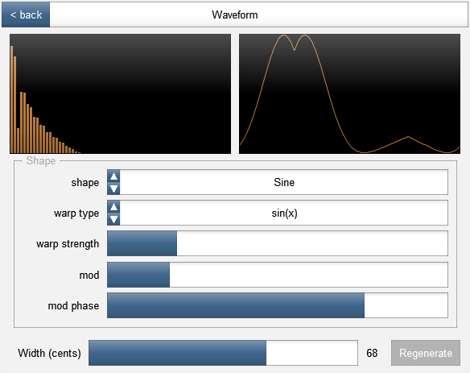

# PadSynth

This is a synth written in REAPER's JSFX language.

To use, copy `pad-synth.jsfx` to REAPER's JSFX directory.  This synth uses a JSFX UI library for its interface - you'll need to have `ui-lib.jsfx-inc` in the same directory as this synth for it to work.

Demos are available in the `demos/` directory.

## Features

### Generates its own samples

A "model waveform" is generated, and this is used to generate a set of patches used by a sampling engine.



This is based on the "padsynth" algorithm from ZynAddSubFX, where the samples are designed in the frequency domain and then IFFT'd.

### Intermodulated effects

This synth has its own effects chain applied separately for each note, including modulators that can alter other effects' parameters (or the note pitch/amplitude).

Currently, available effects are:

*	Filter - 2nd-order lowpass with basic envelope and note/velocity response.  Various parameters (e.g. frequency and Q) are automatable.
*	LFO - can modulate other effects.  Frequency and amplitude of LFO are themselves modulatable.
*	Controller/Note/Velocity modulator - modulates other effects using controller values, note number or velocity

Want to make your vibrato dependent on the note velocity?  Want to make your filter frequency dependent on the Expression controller (11)?  Just hook it up.

## Development

The code is in `pad-synth.txt`.  This project makes use of a [JSFX preprocessor](https://www.npmjs.com/package/jsfx-preprocessor) that I wrote, and this is what generates `pad-synth.jsfx`.

This means that to assemble the final code, you'll need Node.js installed.

```
node build.js /path/to/pad-synth.jsfx
```

If you omit the argument, it builds `pad-synth.jsfx` in the current directory.

## Goals

### Speed

It's a little slow at the moment - I don't know how much of this is just because it's written in JSFX, but maybe there are some things that could speed it up.

### More effects

Different filter types, mult-stage filters, modulation/distortion effects.

Only per-note effects need to be part of this synth - any "global" effect (e.g. reverb) is better implemented as a separate plugin, placed after this one in the chain.

### Longer samples

Currently, samples are generated using the longest (I)FFT REAPER provides (32768).  At 48k (which is what the samples all use internally), this is less than a second, so you can hear the sample loop quite easily.

However, we can probably work around this by doing the IFFT in two stages, and doing our own shuffling in between to get things in order.  It will be slower, but the IFFT is not actually the slowest part of sample generation, so it might not even be noticeable.

### Pitch bend, other controllers

Currently ignores pitch bend.